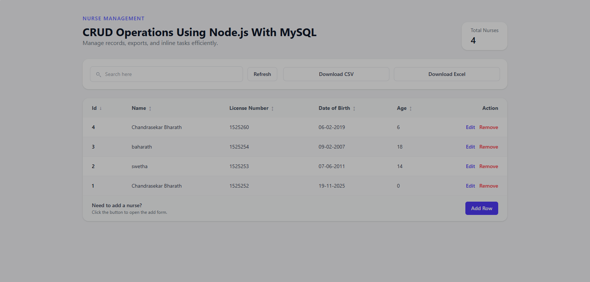

# Nurse Management System
Full-stack nurse directory with instant CRUD, exports, and analytics for hospital ops.  
[](https://react.dev) [](https://vitejs.dev) [](https://tailwindcss.com) [](https://expressjs.com) [](https://www.mysql.com)

## Overview
Nurse Management System is a Vite + React dashboard backed by an Express API and MySQL database that helps hospital administrators create, audit, and export nurse rosters in seconds. Users can run full CRUD flows, search/sort across multiple fields, edit via an accessible modal with live validation, and export CSV/XLSX snapshots without leaving the page. Differentiators include debounced search that keeps the list responsive, age auto-calculation from date of birth, consistent toast feedback, and download-ready exports powered by server-side streaming.

## Architecture
- **Frontend**: React 19 + Vite + TailwindCSS, componentized into `NurseTable`, `SearchBar`, and `NurseModal`. API calls live in `frontend/src/services/api.js` with helper utilities for formatting and file downloads.
- **Backend**: Node 18 + Express 4. Routes are defined in `backend/routes/nurseRoutes.js`, controllers encapsulate logic, `express-validator` enforces input rules, and CSV/XLSX generation happens in `exportService.js`.
- **Database**: MySQL schema (`database/schema.sql`) provisioned via XAMPP or native MySQL. Uses a single `nurses` table with computed timestamps.

```
nurse-management/
├── backend/
│   ├── config/database.js         # MySQL connection pool
│   ├── controllers/nurseController.js
│   ├── routes/nurseRoutes.js
│   ├── middleware/validation.js
│   ├── services/exportService.js
│   ├── utils/nurseUtils.js
│   ├── env.example
│   └── server.js
├── frontend/
│   ├── public/screenshot.png      # add your UI screenshot here
│   ├── src/
│   │   ├── components/{NurseTable,NurseModal,SearchBar}.jsx
│   │   ├── services/api.js
│   │   ├── utils/helpers.js
│   │   ├── App.jsx
│   │   └── main.jsx
│   └── vite.config.js
├── database/schema.sql
├── postman/NurseManagement.postman_collection.json
└── API_DOCUMENTATION.md
```

## Features
### Backend
- RESTful CRUD endpoints with query-based search/sort and pagination-ready architecture.
- Input validation through `express-validator`, including license uniqueness checks.
- Auto age calculation in controllers to keep data normalized.
- CSV and XLSX exports created on-demand via `csv-writer` and `xlsx`.

### Frontend
- Debounced search bar with manual refresh, sort toggles, and empty states.
- Reusable table with visual sort indicators and inline action buttons.
- Modal form for add/edit with auto age field, client-side validation, and disabled submission state.
- Toast notifications for success/failure, download helpers for CSV/XLSX, and summary stats.

### Operations
- Consistent `.env` pattern across backend/frontend for API URLs and DB credentials.
- Postman collection with runnable examples and base URL variable.
- Lightweight utilities for formatting dates, downloading files, and building sort payloads.

## Prerequisites
- Node.js 18+ (LTS recommended)
- npm 9+ (bundled with Node)
- Git
- MySQL 8+ (XAMPP stack or standalone server)
- Optional: Postman for manual API testing

## Setup
### 1. Database
1. Start MySQL (via XAMPP or `mysqld`).
2. Run the schema script:
   ```bash
   mysql -u root -p < database/schema.sql
   ```
3. Confirm the `nurse_management.nurses` table exists with columns: `id`, `name`, `license_number`, `date_of_birth`, `age`, `created_at`, `updated_at`.

### 2. Backend
1. Copy environment template:
   ```bash
   cd backend
   copy env.example .env         # PowerShell
   # or
   cp env.example .env           # bash
   ```
2. Update `.env` with your credentials:
   ```env
   PORT=5000
   DB_HOST=localhost
   DB_USER=root
   DB_PASSWORD=your_password
   DB_NAME=nurse_management
   ```
3. Install dependencies and start the API:
   ```bash
   npm install
   npm run dev  # watches server.js; use npm start for production
   ```
4. Verify `http://localhost:5000/` responds with “Nurse Management API is running”.

### 3. Frontend
1. Create a `.env` file:
   ```bash
   cd ../frontend
   copy .env.example .env  # if you maintain one, otherwise create manually
   ```
2. Add the API origin (Vite exposes `import.meta.env`):
   ```env
   VITE_API_URL=http://localhost:5000/api
   ```
3. Install dependencies and launch Vite:
   ```bash
   npm install
   npm run dev
   ```
4. Open the URL printed in the console (default `http://localhost:5173`).

### 4. Postman
1. Import `postman/NurseManagement.postman_collection.json`.
2. Set the `base_url` collection variable to `http://localhost:5000`.
3. Run saved requests to validate CRUD, search, and export endpoints.

## How to Use
1. Start the backend (`npm run dev` in `backend`) and the frontend (`npm run dev` in `frontend`).
2. Use the search bar for name/license/date queries; results throttle with a 250 ms debounce.
3. Click column headers to toggle ascending/descending sort.
4. Choose **Add Row** to open the modal, complete the form, and submit; age is calculated from the selected DOB.
5. Select **Edit** to update an existing nurse; **Remove** prompts before deletion.
6. Use **Download CSV/Download Excel** to receive exports generated by the API.
7. Hit **Refresh** if you need to bypass the debounce and reload immediately.

## API Reference Summary
| Method | Endpoint | Description |
| --- | --- | --- |
| GET | `/api/nurses` | List nurses with `search`, `sortField`, `sortOrder` query params. |
| GET | `/api/nurses/:id` | Fetch a single nurse record. |
| POST | `/api/nurses` | Create nurse; age is computed server-side. |
| PUT | `/api/nurses/:id` | Update nurse with validation and duplicate license check. |
| DELETE | `/api/nurses/:id` | Remove nurse permanently. |
| GET | `/api/nurses/export/csv` | Download CSV snapshot. |
| GET | `/api/nurses/export/xlsx` | Download Excel snapshot. |

Full payloads, success/error schemas, and sample responses live in `API_DOCUMENTATION.md`.

## Data Model
| Column | Type | Description |
| --- | --- | --- |
| `id` | INT, PK, auto increment | Unique nurse identifier. |
| `name` | VARCHAR(255), required | Full name. |
| `license_number` | VARCHAR(50), unique, required | Nursing license ID. |
| `date_of_birth` | DATE, required | Used to compute age. |
| `age` | INT, required | Derived age at creation/update time. |
| `created_at` | TIMESTAMP | Auto-generated creation timestamp. |
| `updated_at` | TIMESTAMP | Auto-updated on modifications. |

## Testing & Linting
- Frontend linting: `cd frontend && npm run lint`.
- Backend currently has no automated tests or lint scripts; future work should add Jest or vitest coverage plus ESLint.

## Troubleshooting
- **MySQL connection refused**: ensure MySQL is running, credentials match `.env`, and the user has `CREATE/ALTER` permissions.
- **Port already in use**: update `PORT` in `backend/.env` or run `npx kill-port 5000`; restart Vite if 5173 is taken.
- **CORS or network errors**: confirm `VITE_API_URL` matches your backend origin including `/api`.
- **Exports download blank**: verify there are records in `nurses` and that browsers allow file downloads.

## Deployment Notes
- Configure `.env` files with production DB credentials and secure ports before deploying.
- Update `VITE_API_URL` to point to the deployed API (e.g., `https://api.example.com/api`); rebuild the frontend afterward.
- Enable HTTPS and lock down the API with authentication before exposing publicly.
- For containerized deployments, mount `database/schema.sql` during migrations or use a migration tool.

## Screenshot
Place a PNG capture of the dashboard at `frontend/public/screenshot.png` (create the `public` file if it doesn't exist).  


## Contributing
1. Fork the repo and create a feature branch.
2. Run linting before opening a pull request.
3. Include screenshots or Postman results for UI/API changes.

## License
ISC License © Nurse Management contributors.
